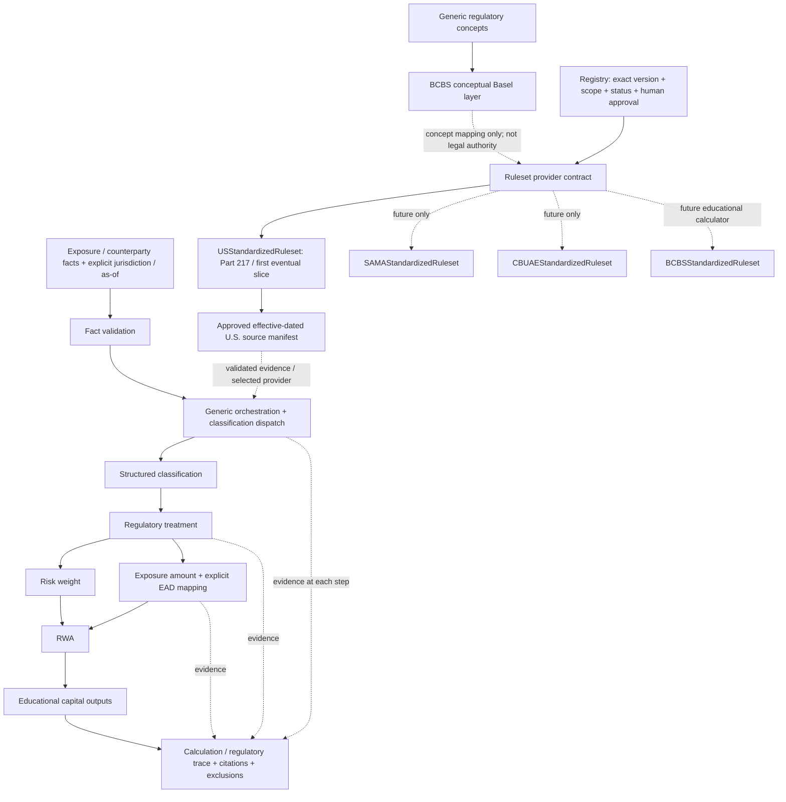

# ADR 0004: Generalized regulatory engine with pluggable jurisdiction rulesets

Status: PROPOSED — PLANNING ONLY — NOT ACTIVE

Date: 2026-09-08.
Decision sponsor: project owner, via the explicit Sprint 02 architecture-revision request.
The architectural direction is owner-approved; this ADR remains proposed until Sprint 02 activation.
It grants no approval of regulatory interpretation, source versions, or executable calculations.

## Context

Financial Pods needs an explainable, deterministic regulatory engine that can outlive one borrower,
lesson, or jurisdiction. A calculator built around Alpha Manufacturing would entangle fixture
facts with regulatory policy. The earlier BCBS-first proposal also risks confusing conceptual Basel
standards with binding U.S. requirements.

The first Golden Case is synthetic FinBank's USD 10 million corporate term loan to Alpha Manufacturing.
It tests the engine; it does not define the engine. No branch, rule lookup, rate, classification,
or output may depend on those names or a special case ID.

## Proposed decision

### Generic core and boundaries

Design framework-independent typed facts, structural validation, classification dispatch, provider
contracts, exact arithmetic utilities, versioned results, canonical hashing, and first-class trace.
The generic core contains no jurisdiction formulas or borrower-specific logic.
U.S. regulatory results are derived only through the selected approved U.S. provider.

BCBS supplies a conceptual vocabulary/taxonomy/comparison layer. Domestic providers may reference
those concepts but must supply their own executable authority. Concept links are not code inheritance,
and no missing U.S. rule may fall back to a BCBS rate or definition.

### Final target architecture diagram



Provider selection precedes any regulatory classification. The generic classification layer
dispatches to the selected provider; it is not a jurisdiction-blind classifier. Risk weight and
exposure amount are parallel treatment outputs, not one derived from the other. Trace evidence is
collected throughout, not fabricated after the numeric result.

Conceptual layering and later reuse:

```text
Generic Regulatory Concepts
          |
BCBS Basel Concept Layer (terminology / comparison, NOT binding U.S. law)
          |
   Provider contracts and concept mappings
          |
   +-- USA / 12 CFR Part 217       first eventual executable jurisdiction
   +-- SAMA                       future, independently reviewed
   +-- CBUAE                      future, independently reviewed
   +-- BCBS educational ruleset   future, explicitly non-domestic

Potential later Regxify Regulatory Core (not extracted now)
   +-- Financial Pods: education / explanation / simulation
   +-- AI Regulatory OS: enterprise regulatory workflows
```

### Provider abstraction

Propose a RegulatoryRuleset interface with explicit, pure operations:

```text
classify_exposure(facts, context) -> ClassificationResult
resolve_treatment(classification, facts, context) -> RegulatoryTreatment
determine_exposure_amount(facts, treatment, context) -> ExposureMeasure
determine_risk_weight(facts, treatment, context) -> RiskWeight
calculate_rwa(exposure_measure, risk_weight, context) -> RwaResult
calculate_capital_teaching_outputs(rwa, context) -> TeachingOutput[]
generate_trace(step_evidence, context) -> CalculationTrace
```

Context binds jurisdiction, regulator/regime, as-of date, and exact approved manifest. Explicit
prior results prevent hidden repeated classification or inconsistent measurements.
A registry selects a provider; core orchestration never scatters if-US/if-SAMA rules.
Providers declare required facts and unsupported scope, fail closed, and emit typed evidence.
No runtime plugin loader, service framework, or additional repository is required for the first slice.

Only USStandardizedRuleset is planned for initial implementation after activation. Other provider
names are extension contracts, not a commitment to implement all jurisdictions during Sprint 02.

### U.S.-first scope and source discipline

The proposed first executable path is the ordinary corporate Golden Case under Federal Reserve
12 CFR Part 217 standardized treatment. It is not all U.S. banks, all corporate variants, or a broad
Basel III calculator. Applicability, exclusions, legal versions, and candidate locators are maintained
in [FRAMEWORK_SCOPE.md](../../sprints/sprint-02/FRAMEWORK_SCOPE.md), not duplicated as generic policy.

That source register proposes §§ 217.1/217.30 for scope, § 217.2 for classification/measurement,
§ 217.32(f)(1) for ordinary corporate weight with exception screening, § 217.31 for RWA, and
§ 217.10 for a specifically labelled teaching transformation. Final legal interpretation is pending.

Legal lifecycle CURRENT / PROPOSED / FUTURE / SUPERSEDED is separate from internal APPROVED review.
Execution must use an approved, effective-for-as-of manifest and allowed status. A proposal cannot
silently replace a current rule. Exact source bytes/locators/dates/hashes, interpretation,
applicability, exclusions, and personally named reviewer evidence are mandatory before activation.
Approved content is immutable; later status/revocation decisions preserve append-only history.

### Fact / result / trace separation

Case facts and regulatory rules are distinct. A new regulatory enrichment contract must not mutate
Sprint 01's accepted fixture or reinterpret its money/percentage units. Missing material facts and
unsupported inputs produce typed errors. Later exposures add versioned fact/provider capabilities,
not borrower-name branches.

Classification returns jurisdiction, ruleset/version, class/subclass, reason codes, references, and
warnings. Calculation returns classification/treatment, exposure amount, risk weight, explicit EAD
semantics, RWA, educational capital outputs, rule/version/hash metadata, trace, citations, warnings,
and exclusions. Exact names and draft schema versions live in FRAMEWORK_SCOPE.md.

The first EAD slot is proposed as an explicitly labelled standardized exposure-amount alias.
It is not advanced-approaches EAD. Educational capital equivalents are not actual bank ratios or
complete regulatory capital requirements. Both choices require human approval before execution.

Trace is a first-class ordered immutable object containing step IDs, rule/version, reason, source
locator, inputs used, output, and warnings. Non-regulatory steps cite versioned engine contracts.
The core performs no network, database, clock-dependent, random, or LLM-authoritative calculation.

### Local ownership and future reuse

Keep implementation inside the Financial Pods repository until contracts and actual reuse stabilize.
Logical modules can separate generic core and U.S. provider within the existing pure-domain boundary;
package placement is finalized at activation, without premature services or repository extraction.

The engine may later form **Regxify Regulatory Core**, shared by Financial Pods and AI Regulatory OS.
This is an architectural option, not an implemented product, licensing/IP conclusion, or extraction
authorization. Ownership, licensing, security, and consumer contracts need later review.

Before expanding toward the owner's existing Basel/ERBA engine, conduct a separately authorized
integration analysis: inventory reusable calculations and rights, compare domain facts and units,
classification/provider structures, source/version semantics, and trace contracts; determine what
belongs in the shared core and test adapter feasibility. Do not claim compatibility without inspection,
blindly recreate existing components, copy unreviewed code, or integrate that engine during this sprint.
Financial Pods prioritizes explainability, citations, deterministic rules, and education-friendly outputs.

### Later BCBS calculator

A BCBS Standardised Approach Calculator may use a separate reviewed BCBSStandardizedRuleset.
Future classes/treatments include sovereign, bank, corporate, corporate SME, retail, real estate,
defaulted, specialised lending, subordinated, equity, off-balance-sheet, and CRM.
They are roadmap items, not Sprint 02 implementations or implicit jurisdiction overlays.

## Alternatives and consequences

- Reject a one-off Alpha Manufacturing calculator: fixture identity must not define rule behavior.
- Reject a universal BCBS numerical base with scattered domestic overrides: authority and versions
  must remain explicit and independently reviewable.
- Reject implementing every provider/exposure class now: one narrow U.S. path proves the abstraction.
- Reject immediate shared-repository extraction: validate contracts inside Financial Pods first.

Benefits: name-independent reuse, reproducible versioned outputs, traceable U.S. authority, and later
jurisdiction expansion without replacing orchestration. Costs: more explicit facts, source manifests,
typed contracts, review gates, and compatibility discipline even for the first case.
Generic design does not imply broad regulatory coverage.

## Acceptance and unresolved decisions

Personally named human review must approve U.S. source versions/locators, institution perimeter,
interpretation, as-of policy, Golden Case assumptions, classification, risk weight, RWA,
capital-teaching outputs, EAD terminology, and exclusions. Review all six activation dimensions:
framework, jurisdiction, sources, calculation scope, golden outputs, and regulatory review process.

The owner must explicitly approve the control pack and promote this ADR from proposed at activation.
AI may assist but cannot be the accountable reviewer. Until then:

SPRINT 02 REMAINS INACTIVE
